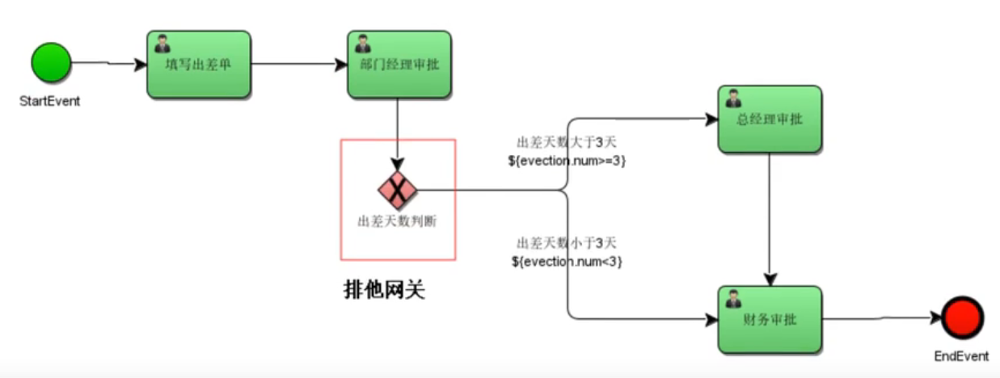
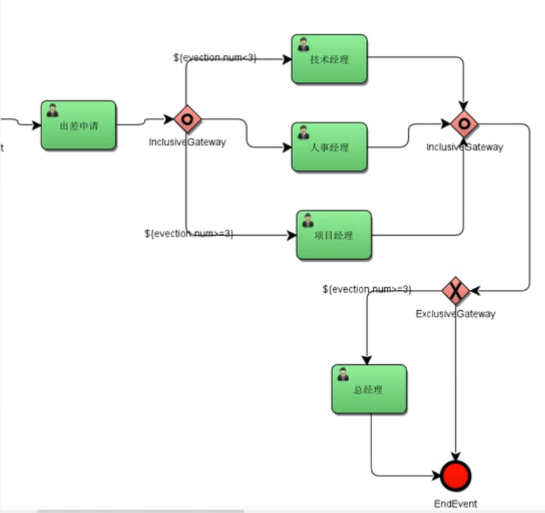
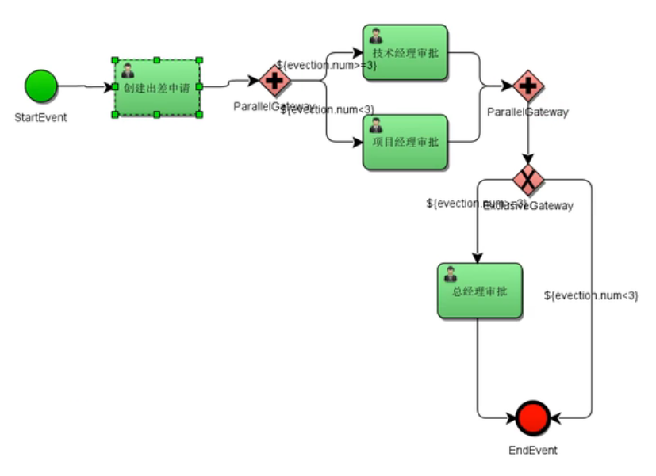
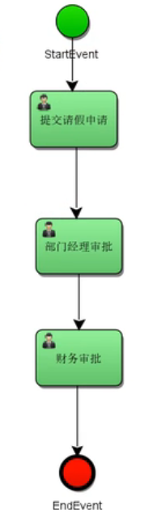
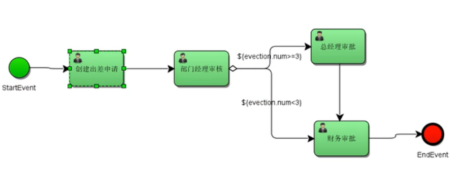

# 创建数据库表结构
1.在ActivitiDemo/BasicDemo/src/main/resources/activiti.cfg.xml，配置好数据库链接信息 
2.然后在com.roy.TestCreateTable测试类，执行建表语句
# 模块示例划分
1.ActivitiBusinessDemo--携带业务key，创建流程的示例 
2.ActivitiGatewayExclusive--排他网关的案例 

3.ActivitiGatewayInclusive--包含网关的案例 

4.ActivitiGatewayParallel--并行网关的案例 
条件在并行网关会被忽略 

5.BaseActivitiDemo--基础的案例 

 6.TestAssigneeUel--uel表达式指定负责人案例 
7.TestCandidate--候选人、任务分配案例 
8.TestVariables--流程变量相关案例 
